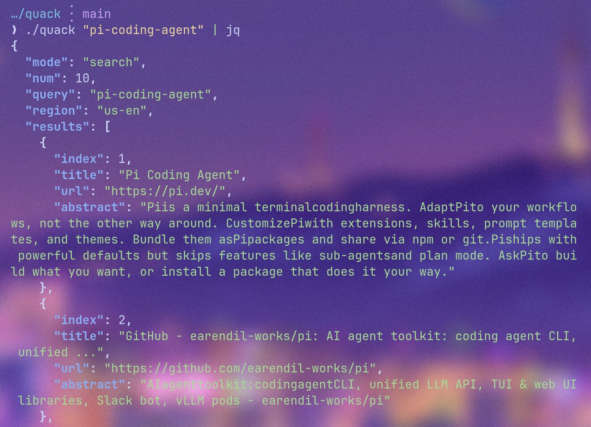

# quack

Zero configuration DuckDuckGo + Bing CLI search & page content fetcher with JSON outputs.



## Install

```bash
go install github.com/zyoung11/quack@latest
```

Or build from source:

```bash
git clone https://github.com/zyoung11/quack.git
cd quack
go build -ldflags="-s -w" .
```

## Usage

**Search (parallel DDG + Bing, DDG preferred):**

```bash
quack KEYWORDS... [options]
```

**Fetch page content:**

```bash
quack URL
```

## Options

| Flag | Description |
|------|-------------|
| `-n N` | Result count (default 10) |
| `-t SPAN` | Time range: d, w, m, y |
| `-w SITE` | Restrict to site (domain or domain/path) |
| `-r REG` | Region (default us-en), e.g. cn-zh |
| `-e E` | Force engine: `ddg` or `bing` (default: both) |
| `-v` | Print version |
| `-h` | Print help |

Search queries both DuckDuckGo and Bing simultaneously.
Output includes a `"source"` field indicating which engine was used.

## Examples

```bash
quack golang -n 5
quack -e bing "golang" -n 5
quack "AI news" -n 10 -t w -r cn-zh
quack -w "go.dev" "golang"
quack https://go.dev/blog/
```

## Output

Both modes return JSON with a `timestamp` field (UTC). Search results include a `"source"` field (`"ddg"` or `"bing"`). Fetched pages include `description` and `published` when found in HTML meta tags.
